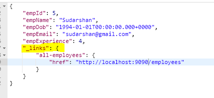
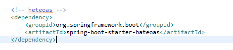
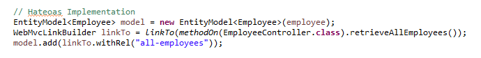

# Hwteoas Implementation for Spring Boot Rest Service Application

## Desscription
Hateoas is used for sending additional info along with the rest services for example, We are exposing user details by id, for the same rest service response we will add a link to fetch all users.



## Running Spring rest locally

You can then access Restfull based on the port which you configure in property file. Lets say if you configured port 9090 means
you can access it by http://localhost:9090/

## In case you find a bug/suggested improvement for Spring Restfull Webservices
Our issue tracker is available here: https://github.com/Sudarshan-Gowda/Spring-Boot-Rest-Service-Hateoas/issues


## Working with Rest in Eclipse

### prerequisites
The following items should be installed in your system:
* Tool - STS(Spring Toot Suite) or Eclipse
* Server - Apache Tomcat 7
* Database - MySQL
* Postman

### Steps:

1) Download this Project and do maven import.
```
https://github.com/Sudarshan-Gowda/Spring-Boot-Rest-Service-Hateoas.git
```
2) To Import the Praject Using STS or Eclipse.
```
File -> Import -> Maven -> Existing Maven project
```


## Looking for something in particular?

|Spring Boot Configuration | Class or Java property files  |
|--------------------------|---|
|The Main Class | [EmployeeController]
(https://github.com/Sudarshan-Gowda/Spring-Boot-Rest-Service-Hateoas/blob/master/src/main/java/com/star/sud/controller/RestController.java) |
|Properties Files | [application.properties]
(https://github.com/Sudarshan-Gowda/Spring-Boot-Rest-Service-Hateoas/blob/master/src/main/resources/application.properties) |
|Data Base Scripts Files | [scripts.sql]
(https://github.com/Sudarshan-Gowda/Spring-Boot-Rest-Service-Hateoas/blob/master/src/main/resources/scripts.sql) |

## Steps to test the application:

1) Once the application is installed properly, Run the application
2) Once the application is deployed properly, Create schema and execute query into database. 
   For scripts reference use the link [scripts.sql]
   (https://github.com/Sudarshan-Gowda/Spring-Boot-Rest-Service-Hateoas/blob/master/src/main/resources/scripts.sql)
3) To enable the hateoas we need to use the dependency called hateoas in you pom project as below
    
4) You just need to add the some simple piece of code to make the hateoas to be enabled in rest services.
   
5) Find the below exposed urls to see the hateoas configured for the rest service application.
	```	
	http://localhost:9090/employees/{id}
 
	```
6) Observe the below response where hateoas is configured & will be shown with additional information like links to get into other urls.
You can configure N number of urls in hateos in ur rest services.

   
# Contributing

The [issue tracker]
(https://github.com/Sudarshan-Gowda/Spring-Boot-Rest-Service-Hateoas/issues) is the preferred channel for bug reports, features requests and submitting pull requests.

